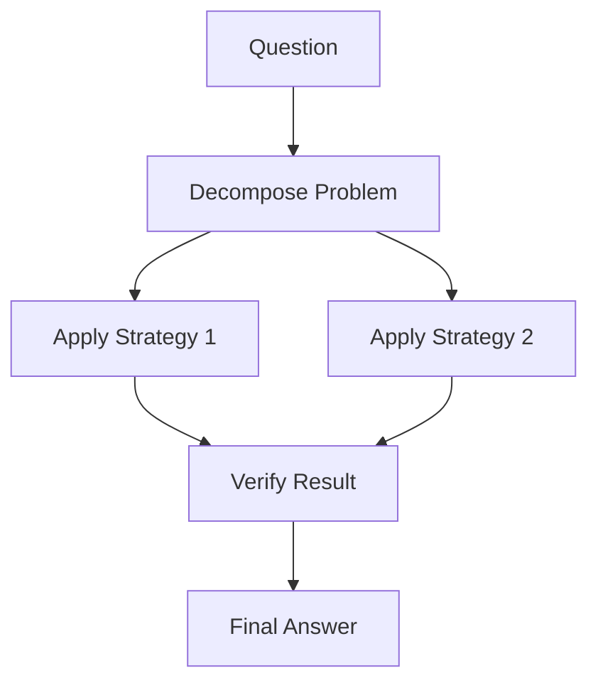

# Reasoning Data Interchange Standards: Problem Analysis and Research Landscape

## Abstract

As Large Language Models (LLMs) increasingly demonstrate sophisticated reasoning capabilities, the lack of standardized formats for representing and exchanging reasoning traces has emerged as a critical technical challenge. This document analyzes the current fragmentation in reasoning data formats, examines emerging research directions toward standardization, and evaluates potential approaches for achieving interoperability between different reasoning systems.

## 1. Problem Motivation

The emergence of reasoning-capable LLMs like OpenAI's o1, Anthropic's Claude with thinking, and DeepSeek-R1 has introduced a critical technical challenge: each system employs proprietary formats for representing internal reasoning processes, creating a fragmented ecosystem that limits interoperability and tool development.

### 1.1 Technical Manifestation

This fragmentation manifests in concrete ways:

- **Schema Incompatibility**: Reasoning traces from one system fail validation when processed by another
- **Translation Complexity**: Converting between formats requires deep understanding of semantic differences
- **Information Loss**: Format mismatches can result in loss of reasoning context and metadata
- **Development Overhead**: Building multi-provider systems requires custom translation layers

### 1.2 Research and Development Impact

The lack of standardization creates barriers across multiple dimensions:

- **Cross-system Analysis**: Comparing reasoning patterns across different model architectures becomes difficult
- **Tool Fragmentation**: Analysis and auditing tools must be developed separately for each provider
- **Research Reproducibility**: Studies involving multiple reasoning systems face format compatibility challenges
- **Knowledge Transfer**: Insights gained from one system's reasoning cannot easily inform others

### 1.3 Current State Analysis

Our practical experience implementing schema translation between OpenAI and Anthropic reasoning formats reveals both the immediate technical challenges and the broader landscape of emerging solutions. This document examines the current fragmented state and analyzes research directions that may point toward future standardization.

## 2. Current Landscape

### 2.1 Provider-Specific Formats

#### OpenAI o1/o3 Format
```json
{
  "type": "reasoning",
  "reasoning": "full reasoning content...",
  "details": [{
    "type": "text",
    "text": "reasoning step content",
    "signature": "optional metadata"
  }]
}
```

#### Anthropic Claude Format  
```json
{
  "type": "reasoning",
  "thinking": {
    "signature": "required metadata",
    "content": "reasoning content"
  }
}
```

#### DeepSeek-R1 Format
Uses `<thinking>` tags with unstructured internal reasoning followed by final responses.

### 2.2 Schema Incompatibility Issues

The fundamental problem manifests as validation errors when reasoning traces from one provider are passed to another:

```
"messages.3.content.0.thinking.signature: Field required"
```

This error occurs because OpenAI's reasoning format treats `signature` as optional while Anthropic's format requires it, illustrating the broader incompatibility between reasoning schemas.

## 3. Emerging Research Directions

Recent research (2025) indicates several promising approaches to standardizing reasoning data interchange:

### 3.1 Semi-Structured Reasoning Models (SSRMs)

**Key Insight**: Use Pythonic syntax for reasoning traces with restricted, task-specific vocabularies.

**Advantages**:
- Human-readable yet machine-parseable
- Enables automatic auditing and error detection
- Provides clear input/output markers for each reasoning step
- Maintains semantic structure while being format-agnostic

**Example SSRM Format**:
```python
def solve_problem(question):
    # Step 1: Parse the question
    components = extract_components(question)
    
    # Step 2: Apply reasoning strategy
    strategy = select_strategy(components.type)
    intermediate_result = strategy.apply(components)
    
    # Step 3: Verify result
    verification = verify_answer(intermediate_result, question)
    return verification.final_answer
```

### 3.2 ReasoningFlow Schema

**Approach**: Parse reasoning traces into directed acyclic graphs (DAGs) to capture semantic structure.

**Benefits**:
- Provider-agnostic representation
- Enables pattern analysis across different reasoning styles
- Supports complex reasoning with branching, backtracking, and verification
- Human-interpretable visualization of reasoning processes

**Graph Structure**:


### 3.3 Circuit Tracing Framework

**Focus**: Understanding internal computational pathways in reasoning models.

**Potential for Standardization**:
- Could provide canonical representations of reasoning "circuits"
- Enables cross-model comparison of reasoning mechanisms
- Supports development of provider-agnostic analysis tools

### 3.4 OpenThoughts Project

**Contribution**: Large-scale open datasets with systematic reasoning data generation.

**Standardization Impact**:
- Establishes common training data formats
- Provides reference implementations for reasoning pipelines
- Creates benchmarks for cross-system evaluation

## 4. Why Standardization Matters

### 4.1 Technical Benefits

1. **Interoperability**: Seamless integration between different reasoning systems
2. **Tool Development**: Universal analysis, auditing, and debugging tools
3. **Research Acceleration**: Easier comparison and reproducibility across systems
4. **Quality Assurance**: Automated detection of reasoning errors and biases

### 4.2 Economic Benefits

1. **Reduced Integration Costs**: No need for custom translation layers
2. **Vendor Independence**: Avoid lock-in to specific reasoning formats
3. **Ecosystem Growth**: Enable third-party tool development
4. **Knowledge Reuse**: Leverage reasoning insights across platforms

### 4.3 Safety and Reliability Benefits

1. **Auditing**: Systematic analysis of reasoning processes for errors and biases
2. **Transparency**: Clear understanding of how AI systems reach conclusions
3. **Verification**: Automated checking of reasoning validity
4. **Accountability**: Traceability of AI decision-making processes

## 5. Proposed Standardization Framework

### 5.1 Core Principles

1. **Provider Neutrality**: Standards should not favor any specific implementation
2. **Semantic Preservation**: Capture the full meaning of reasoning processes
3. **Extensibility**: Support future reasoning paradigms and capabilities
4. **Tool Compatibility**: Enable development of universal analysis tools
5. **Human Interpretability**: Maintain readability for human analysts

### 5.2 Multi-Layer Architecture

```
┌─────────────────────────────────────┐
│        Application Layer            │
│    (Analysis Tools, Debuggers)     │
├─────────────────────────────────────┤
│      Interchange Layer              │
│   (Universal Reasoning Format)     │
├─────────────────────────────────────┤
│       Translation Layer             │
│  (Provider-Specific Adapters)      │
├─────────────────────────────────────┤
│        Provider Layer               │
│  (OpenAI, Anthropic, DeepSeek)     │
└─────────────────────────────────────┘
```

### 5.3 Reference Implementation

Building on our experience with OpenAI ↔ Anthropic translation:

```typescript
interface UniversalReasoningTrace {
  id: string;
  provider: Provider;
  model: string;
  
  // Core reasoning content
  steps: ReasoningStep[];
  metadata: ReasoningMetadata;
  
  // Validation and integrity
  schema_version: string;
  checksum: string;
}

interface ReasoningStep {
  id: string;
  type: "analysis" | "synthesis" | "verification" | "planning";
  content: string;
  inputs: string[];
  outputs: string[];
  confidence?: number;
  citations?: string[];
}

interface ReasoningMetadata {
  task_type: string;
  complexity_score?: number;
  reasoning_time_ms?: number;
  provider_specific?: Record<string, unknown>;
}
```

## 6. Implementation Considerations

### 6.1 Technical Challenges

The path toward standardization faces several technical hurdles:

- **Semantic Mapping**: Different reasoning systems may represent the same logical operations in fundamentally different ways
- **Performance Overhead**: Real-time translation adds latency and computational cost
- **Format Evolution**: Providers continuously evolve their internal representations
- **Information Loss**: Translation between formats may not preserve all semantic nuances

### 6.2 Adoption Dynamics

Historical precedents suggest standardization follows predictable patterns:

- **Early Phase**: Fragmentation with provider-specific formats (current state)
- **Convergence Phase**: Emergence of translation layers and compatibility tools
- **Standardization Phase**: Industry consensus around common interchange formats
- **Optimization Phase**: Performance improvements and extended capabilities

### 6.3 Implementation Approaches

Three primary implementation strategies emerge from our analysis:

1. **Translation Layer Approach**: On-demand conversion between formats (our current implementation)
   - Advantages: Immediate compatibility, minimal provider changes required
   - Disadvantages: Performance overhead, potential information loss

2. **Universal Format Approach**: New standard that all providers adopt
   - Advantages: Maximum efficiency, no translation overhead
   - Disadvantages: Requires industry coordination, migration complexity

3. **Hybrid Approach**: Common core with provider-specific extensions
   - Advantages: Balances compatibility with innovation flexibility
   - Disadvantages: Complexity in handling extensions, partial standardization

## 7. Lessons from Our Implementation

Our experience implementing schema translation between OpenAI and Anthropic formats provides several key insights:

### 8.1 What Works
- **Simple field mapping** for basic compatibility
- **Defensive programming** to handle missing or malformed data
- **Graceful degradation** when perfect translation isn't possible
- **Comprehensive testing** across different reasoning scenarios

### 8.2 What's Challenging
- **Semantic gaps** between different reasoning approaches
- **Metadata loss** when translating between formats
- **Performance overhead** of real-time translation
- **Maintaining compatibility** as providers evolve their formats

### 8.3 Key Design Principles
- **Preserve maximum information** while ensuring compatibility
- **Fail gracefully** when translation is impossible
- **Log translation decisions** for debugging and improvement
- **Version schemas** to handle format evolution

## 8. Conclusion

The field of AI reasoning is at a critical juncture. As reasoning capabilities become more sophisticated and widespread, the lack of interoperability standards threatens to fragment the ecosystem and limit innovation. However, recent research developments provide promising foundations for universal reasoning data interchange.

Our experience developing practical translation solutions demonstrates both the immediate technical challenges and the potential pathways toward standardization. The emerging research in semi-structured reasoning, graph-based representations, and circuit tracing offers multiple complementary approaches that could form the foundation of future standards.

The fragmentation of reasoning data formats represents a significant but solvable technical challenge. Understanding the current landscape and emerging research directions provides a foundation for evaluating potential standardization approaches as the field evolves.

## References

1. Leng, J., et al. (2025). "Semi-structured LLM Reasoners Can Be Rigorously Audited." arXiv:2505.24217
2. Lee, J., et al. (2025). "ReasoningFlow: Semantic Structure of Complex Reasoning Traces." arXiv:2506.02532  
3. Wu, R., et al. (2025). "KG-TRACES: Enhancing Large Language Models with Knowledge Graph-constrained Trajectory Reasoning." arXiv:2506.00783
4. Guha, E., et al. (2025). "OpenThoughts: Data Recipes for Reasoning Models." arXiv:2506.04178
5. Anthropic Research Team. (2025). "Tracing the thoughts of a large language model." Anthropic Research Blog
6. Raschka, S. (2025). "Understanding Reasoning LLMs: Methods and Strategies for Building and Refining Reasoning Models." Ahead of AI Blog
7. Ke, Z., et al. (2025). "A Survey of Frontiers in LLM Reasoning: Inference Scaling, Learning to Reason, and Agentic Systems." arXiv:2504.09037

---

*This document represents our technical analysis of the current state and emerging directions in reasoning data interchange. It serves as a foundation for understanding the challenges and potential solutions in this evolving field.* 
